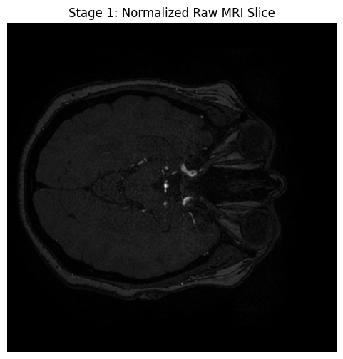
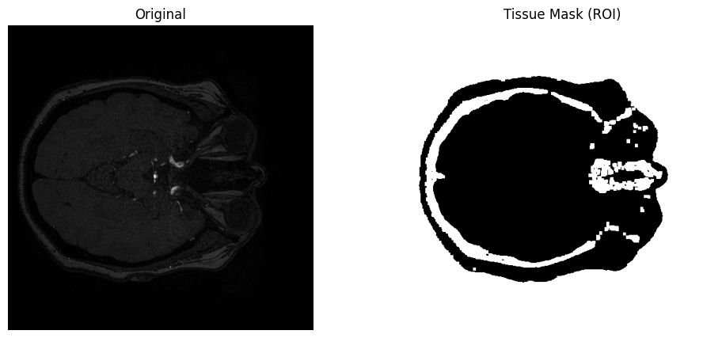
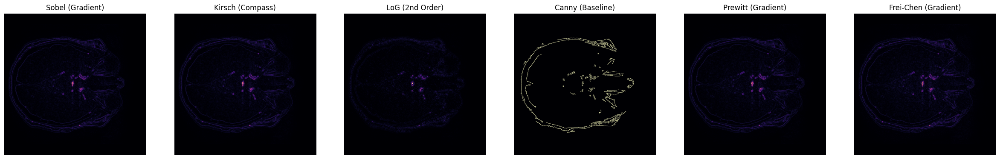
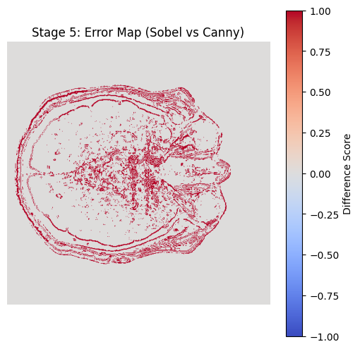
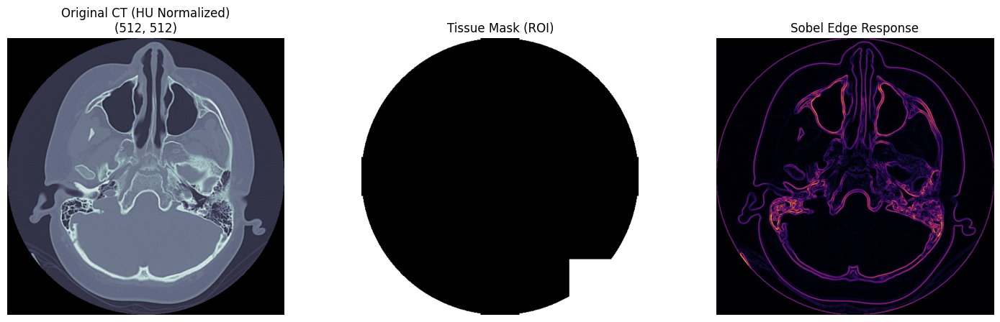
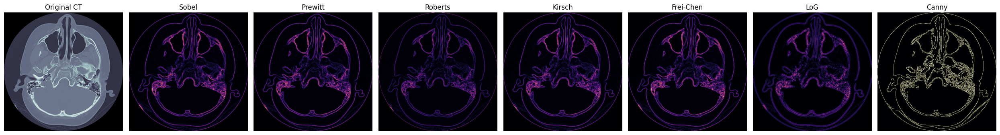
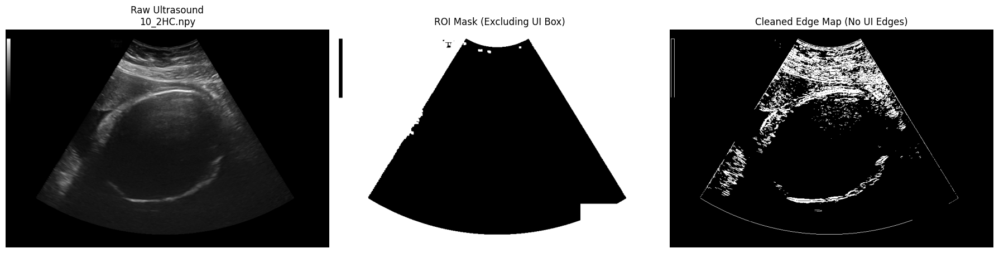
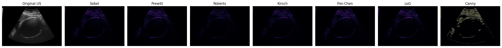

Multi-Modal Biomedical Edge Detection Analysis

📌 Project Overview

This project evaluates the performance of seven classical and advanced edge detection operators—Sobel, Prewitt, Roberts, Kirsch, Frei-Chen, and Laplacian of Gaussian (LoG)—across three distinct medical imaging modalities: MRI, CT, and Ultrasound.

The goal is to determine which mathematical kernels are most robust to the unique noise profiles and anatomical complexities of different medical sensors.

🛠 Tech Stack

* Language: Python 3.9+
* Core Libraries: `pydicom`, `nibabel`, `opencv-python`, `numpy`, `scipy`
* Dataset Handling: Standardized `.npy` (NumPy) format for 16-bit precision preservation.

📂 Project Structure

biomed-edge-detection/
├── data/               # Raw DICOM/NIfTI and standardized .npy slices

├── src/

│   ├── data_prep.py    # Unified pipeline for MRI volumes and CT/US slices

│   ├── operators.py    # Implementation of 7 edge detection kernels

│   ├── metrics.py      # Pratt's Figure of Merit (FOM) & ROI-Gated PSNR

│   └── loaders.py      # Standardized data streaming

├── notebooks/          # Step-by-step visualization of the image pipeline

├── results/            # Quantitative CSV summaries and comparison plots

└── main.py             # Analysis orchestrator

📊 Methodology & Metrics

To ensure scientific validity, all metrics were calculated within a Region of Interest (ROI) using an intensity-based tissue mask. This prevents "background air" from artificially inflating performance scores.

Evaluation Metrics:

1. Peak Signal-to-Noise Ratio (PSNR): Measures the signal fidelity of the gradient magnitude.
2. Pratt's Figure of Merit (FOM): Assesses edge localization and accuracy against an optimized Canny baseline.

📈 Experimental Results

Our analysis revealed that the "optimal" operator is highly dependent on the physics of the modality:

| Modality   | Top Operator | FOM Score | Clinical Context |

| CT         | Sobel        | 0.92      | High contrast makes simple gradient kernels highly accurate.|

| MRI        | Kirsch       | 0.83      | 8-way compass kernels excel at complex cortical folds.|

| Ultrasound | Roberts      | 0.80      | Smaller 2 x 2 kernels are more robust to speckle noise.|

🖼 Visualization

1.A comparison of operator responses on a Brain MRI slice:

a) Normalized Raw MRI Slice

b) ROI Masking

c) Operator Comparison

d) Error Map

2.A comparison of operator responses on a Brain CT slice:

a) Normalized + ROI Mask + Sobel Edge Response

b) Operator Comparison

3.A comparison of operator responses on a Womb Ultrasound Image:

a) Raw Image + ROI Mask + Edge Map

b) Operator Comparison

🚀 Getting Started

1. Prepare Data: Place raw NIfTI/DICOM/JPG files in `data/raw/`.

2. Run Pipeline: 

   python src/data_prep.py
   python main.py
   
3. Analyze: Check `results/metrics_comparison.csv` for full statistical breakdown.

📝 Conclusion

While Canny remains the gold standard for continuous edges, Kirsch provides superior anatomical detail for neuroimaging. Conversely, in resource-constrained environments (like wearable biosensors), the Roberts operator provides a computationally efficient yet accurate alternative for noisy ultrasound signals.

